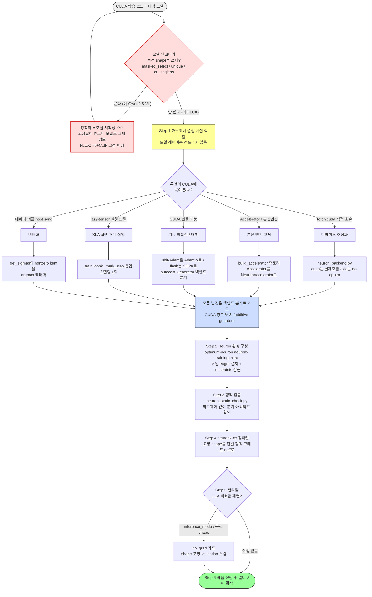

# FLUX.1-Kontext-dev on AWS Trainium — QuickStart (Critical Path)

이 문서는 **순번대로 복사·붙여넣기**만 하면 FLUX.1-Kontext-dev LoRA 학습이 AWS
Trainium에서 시작되는 단일 경로 매뉴얼입니다. 분기 선택은 없습니다. 각 단계에는
**그대로 실행할 명령**과 **끝나면 화면에 나타나는 문구(PASS 신호)** 가 있습니다.

검증 환경 (이 수치로 고정):

| 항목 | 값 |
|---|---|
| 인스턴스 | SageMaker Notebook `ml.trn1.32xlarge` (us-west-2) |
| NeuronCore | 16 chips = 32 cores (이 가이드는 **1 core**로 컴파일 검증) |
| EBS 볼륨 | **512 GB** (모델 ~24GB + Neuron 스택 + 캐시 여유) |
| Python | 3.10 (인스턴스 기본) |
| torch | 2.x (Neuron 빌드, `optimum-neuron[neuronx,training]`이 설치) |
| optimum-neuron | `[neuronx,training]` extra (accelerate 자동 핀) |
| 백엔드 스위치 | `FLUX_BACKEND=xla` |

모델 `black-forest-labs/FLUX.1-Kontext-dev`는 **게이트 모델**(~24GB)이라 HF 토큰 +
라이선스 동의가 필요합니다.

---

## 1. 인스턴스 생성

SageMaker 콘솔 → Notebook instances → Create notebook instance:

- **Notebook instance type**: `ml.trn1.32xlarge`
- **Platform identifier**: Amazon Linux 2, Jupyter Lab 3
- **Volume size in GB**: `512`
- **IAM role**: S3 접근 가능한 기본 SageMaker 역할

생성 후 **Open JupyterLab** → **File → New → Terminal**. 이후 모든 명령은 이
터미널에서 실행합니다.

---

## 2. 디스크 레이아웃 고정

모델 캐시를 큰 볼륨(`/home/ec2-user/SageMaker`)으로 보내 루트(`/`) 포화를 막습니다.

```bash
export HF_HOME=/home/ec2-user/SageMaker/hf_cache
mkdir -p "$HF_HOME"
df -h /home/ec2-user/SageMaker
```

`/home/ec2-user/SageMaker` 볼륨의 `Avail`이 **400G 이상**으로 표시됩니다.

---

## 3. 레포 클론

```bash
cd /home/ec2-user/SageMaker
git clone https://github.com/binchoo/flux-kontext-dev-on-trainium.git
cd flux-kontext-dev-on-trainium
```

화면에 `Receiving objects: 100%` 와 클론 완료 메시지가 표시됩니다.

---

## 4. Neuron 환경 설치 (한 번에)

`setup_neuron.sh`가 fresh venv 생성 → `optimum-neuron[neuronx,training]` 단일
설치 → 정합성 검증까지 수행합니다. HF 토큰은 https://huggingface.co/settings/tokens
에서 read 권한으로 발급하고, FLUX.1-Kontext-dev 모델 페이지에서 라이선스에 동의해
두세요.

```bash
chmod +x setup_neuron.sh run_neuron.sh
./setup_neuron.sh hf_여기에_본인_토큰
```

수 분 후 마지막에 다음이 표시됩니다:

```
torch: 2.x.x          (← +cu 가 없어야 정상)
accelerate: 1.8.x
optimum.neuron.NeuronAccelerator: OK
=== Neuron stack sanity check PASSED ===
=== Setup complete ===
```

---

## 5. 포팅 정적 검증 + 임포트 게이트 (모델 다운로드 전 필수)

모델(~24GB)을 받기 전에, ① 포팅이 온전한지 ② train.py가 필요로 하는 모든
패키지가 실제로 import 되는지 확인합니다. 이 게이트를 통과해야 6단계로 갑니다.

```bash
source .venv-neuron/bin/activate

# (1) 정적 검증
python neuron_static_check.py

# (2) 임포트 게이트 — train.py가 쓰는 핵심 패키지 + torch가 torch-neuronx와 짝인지
python - <<'PY'
import importlib, sys
import importlib.metadata as md
mods = ["torch", "diffusers", "transformers", "accelerate", "peft",
        "torchvision", "PIL", "datasets", "sentencepiece", "optimum.neuron"]
missing = []
for m in mods:
    try:
        importlib.import_module(m)
    except Exception as e:
        missing.append(f"{m}: {e!r}")
if missing:
    print("MISSING:", *missing, sep="\n  ")
    sys.exit(1)
import torch
v = torch.__version__
print("torch:", v)
assert "+cu" not in v, "FATAL: CUDA torch installed (Neuron stack overwritten)"
# torch must match torch-neuronx pairing (e.g. torch-neuronx 2.8.x ↔ torch 2.8.x).
# A newer non-CUDA torch (e.g. 2.12) also breaks Neuron — catch it here.
tnx = md.version("torch-neuronx")
tnx_mm = ".".join(tnx.split(".")[:2])
torch_mm = ".".join(v.split("+")[0].split(".")[:2])
assert torch_mm == tnx_mm, f"FATAL: torch {torch_mm} != torch-neuronx pairing {tnx_mm}"
print("=== import gate PASSED ===")
PY
```

기대 출력:

```
=== Summary ===
passed: 14   failed: 0
All available checks passed.
torch: 2.8.0          (← torch-neuronx와 같은 2.8 라인이어야 정상)
=== import gate PASSED ===
```

> **만약 `MISSING: ...` 또는 `torch X != torch-neuronx pairing Y`가 뜨면** — torch가
> Neuron 짝에서 벗어난 것이니, torch를 짝 버전으로 되돌리고 모델 libs를 `--no-deps`로
> 재설치한 뒤 게이트를 다시 실행:
>
> ```bash
> TNX=$(python -c "import importlib.metadata as m; print('.'.join(m.version('torch-neuronx').split('.')[:2]))")
> pip install --no-deps "torch==${TNX}.0" "torchvision==0.23.*"
> pip install --no-deps diffusers peft
> pip install Pillow tqdm datasets sentencepiece wandb importlib_metadata regex requests filelock pyyaml
> ```

---

## 6. 학습 실행 (1-step 컴파일 포함)

`run_neuron.sh`가 ① `neuron_parallel_compile`로 그래프를 선컴파일하고 ② `torchrun`
으로 학습합니다. 입력 shape(512×512, 텍스트 512, batch 1)는 고정되어 단일 정적
그래프로 컴파일됩니다.

```bash
cd /home/ec2-user/SageMaker/flux-kontext-dev-on-trainium
source .venv-neuron/bin/activate
export FLUX_BACKEND=xla
NUM_CORES=1 ./run_neuron.sh
```

이 단계에서 모델(~24GB)이 `$HF_HOME`로 다운로드되고, 첫 스텝에서
`Compiling ... neuronx-cc` 로그가 수 분간 출력됩니다(정상). 컴파일이 끝나면 스텝이
진행되며 `loss`, `lr` 진행바가 갱신됩니다. 체크포인트는 `OUTPUT_DIR` 아래에
저장됩니다.

---

## 7. NeuronCore 사용 모니터링 (선택 — 별도 터미널)

```bash
neuron-top
```

NeuronCore 사용률이 0보다 큰 값이면 학습이 Trainium에서 실제로 연산 중입니다.

---

## 8. 멀티코어로 확장 (1-step 컴파일 성공 후)

단일 코어 검증이 끝나면 데이터 병렬로 코어를 늘립니다 (trn1.32xlarge = 32 cores):

```bash
NUM_CORES=32 ./run_neuron.sh
```

> EFA/collectives 경고가 멀티코어에서 실제 에러로 바뀌면 `aws-neuronx-collectives`
> 설치 또는 EFA 활성 인스턴스가 필요합니다. 단일 코어(6단계)에서는 무관합니다.

---

## 무엇이 자동으로 처리되었나

이 경로를 그대로 따르면 아래가 사전 차단됩니다:

| 차단된 함정 | 차단한 단계 |
|---|---|
| 루트 디스크 포화로 모델 다운로드 실패 | 1 (512GB) + 2 (HF_HOME) |
| CUDA torch(`+cu`)가 Neuron torch를 덮어씀 | 4 (단일 eager 설치 + constraints) |
| `NeuronAccelerator`/accelerate 버전 불일치 | 4 (`[training]` extra) |
| bitsandbytes 8-bit Adam (CUDA 전용) | 코드가 XLA에서 AdamW로 폴백 |
| flash-attention (CUDA 전용) | FLUX는 SDPA 사용 — 코드 변경 불필요 |
| `get_sigmas`의 `.nonzero().item()` (동적/host sync) | 코드가 XLA에서 벡터화 |
| validation 샘플링 재컴파일 | 코드가 XLA에서 스킵 |

---

# Appendix. CUDA 학습 코드 → AWS Trainium(Neuron/XLA) 포팅 일반 프로세스

아래는 FLUX.1-Kontext 사례에서 도출한 **PyTorch(CUDA) 학습 코드를 Trainium으로
포팅하는 일반 프로세스**입니다. 다른 diffusion/Transformer 학습 코드에도 동일하게
적용됩니다. 핵심 원칙은 **"모델 레이어가 아니라 하드웨어 결합 지점을 포팅"** 이며,
**모델 선정 단계에서 동적 shape 여부를 먼저 거른다**는 점입니다(이것이 Qwen 실패와
FLUX 성공을 가른 분기).



**단계 요약**:

| 단계 | 무엇을 | 산출물·신호 |
|---|---|---|
| 0. 트리아지 | 모델 인코더의 동적 shape 여부 사전 판별 | 동적이면 고정길이 모델로 교체 (Qwen→FLUX) |
| 1. 추상화·교체 | 디바이스 추상화 + 분산엔진 교체 + 기능 대체 + 실행경계 + 벡터화 (전부 가드) | Neuron 분기 코드 |
| 2. 환경 | Neuron 스택 단일 설치 + 의존성 잠금 (§4) | `=== sanity check PASSED ===` |
| 3. 정적 검증 | 하드웨어 없이 포팅 온전성 확인 (§5) | `passed: 13 failed: 0` |
| 4. 컴파일 | neuronx-cc가 고정 shape 그래프를 .neff로 (§6) | `Compiler status PASS` |
| 5. 런타임 패치 | XLA 비호환 패턴 수정 | 학습 진행 |
| 6. 학습·확장 | 단일 코어 검증 → 멀티코어 데이터 병렬 (§8) | loss 하강 |

> **핵심 교훈**: Qwen-Image-Edit은 0단계(트리아지)에서 걸러진다 — Qwen2.5-VL 인코더가
> 동적 shape를 써서 neuronx-cc가 거부(`set-dimension-size`). FLUX.1-Kontext는 T5+CLIP
> 고정 길이 인코더 + 정적 DiT라 통과하며, optimum-neuron이 공식 지원한다. **포팅
> 난이도의 9할은 모델 선정에서 결정된다.**
