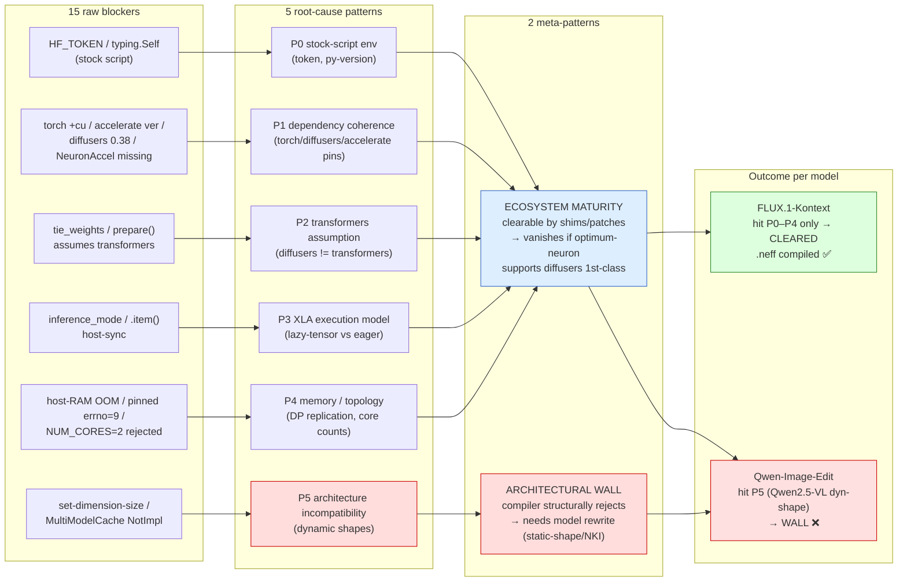

# Diffusers-on-Neuron Blockers — Pattern Analysis

15 blockers hit across two models (Qwen-Image-Edit, FLUX.1-Kontext) collapse into
**5 root-cause patterns**, which in turn split into **2 meta-patterns** that decide a
model's fate: *ecosystem-maturity* blockers (clearable with shims/patches) vs an
*architectural* blocker (a hard wall — needs model rewrite).

This split is exactly what separated FLUX (cleared P1–P4, compiled) from
Qwen-Image-Edit (hit P5, blocked).

---

## Mermaid — blockers → patterns → meta-patterns → outcome

---

## The two meta-patterns

### M1 — Ecosystem maturity (clearable)
`optimum-neuron` does not yet treat `diffusers` *training* as first-class, so the
framework's transformers assumptions, dependency pins, and memory handling leak out
to the user. We cleared every one of these with shims/patches.

> Disappears entirely if `optimum-neuron` ships first-class `diffusers` support
> (this is the PR/FAQ ask). Proof: FLUX **inference** — which IS supported — has
> none of P1–P3.

### M2 — Architectural wall (not clearable by patches)
`neuronx-cc` is a static-shape compiler. A model whose architecture emits
data-dependent shapes (`set-dimension-size`) cannot be patched into compiling — it
must be **rewritten** to static shapes (or use NKI). Qwen-Image-Edit's Qwen2.5-VL
encoder is here. This is a known open AWS issue, not our porting defect.

---

## Blocker → pattern map (full)

| # | Blocker | Model | Pattern | Cleared? |
|---|---|---|---|---|
| 1 | HF_TOKEN KeyError | Qwen | P0 | ✅ .env |
| 2 | `typing.Self` (Py3.10) | Qwen | P0 | ✅ typing_extensions |
| 3 | torch `+cu124` overwrite | Qwen | P1 | ✅ single eager install |
| 4 | NeuronAccelerator missing | Qwen | P1 | ✅ `[neuronx,training]` |
| 5 | accelerate `_shared_state` | Qwen | P1 | ✅ pin 1.8.1 |
| 6 | inference_mode tensor | Qwen | P3 | ✅ no_grad on XLA |
| 7 | **set-dimension-size** | **Qwen** | **P5** | ❌ **WALL** |
| 8 | diffusers missing | FLUX | P1 | ✅ add dep |
| 9 | torch 2.12 overwrite | FLUX | P1 | ✅ --no-deps + constraints |
| 10 | tie_weights absent | FLUX | P2 | ✅ shim |
| 11 | host-RAM OOM (8 core) | FLUX | P4 | ✅ bf16 + fewer cores |
| 12 | pinned memory errno=9 | FLUX | P4 | ✅ bf16 |
| 13 | NUM_CORES=2 rejected | FLUX | P4 | ✅ 1/4/8 |
| 14 | diffusers 0.38 controlnet | FLUX(infer) | P1 | ✅ pin 0.35 |
| 15 | MultiModelCache NotImpl | FLUX(infer) | P5* | ✅ disable_neuron_cache |

\* #15 is a *framework* NotImplemented (cache layer), clearable via flag — distinct
from #7 which is the *compiler* rejecting the model's shapes (the true wall).

## Takeaway

> **4 of 5 patterns (P0–P4) are ecosystem maturity — clearable, and they vanish if
> optimum-neuron supports diffusers training first-class. Only P5 (dynamic-shape
> architecture) is a real wall, and it's the one the customer's model (Qwen) hits.**
> FLUX cleared everything and compiled; Qwen is blocked at P5.
