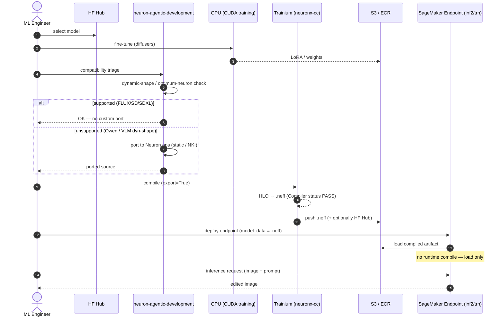

# Diffusers on Neuron — MLOps Collaboration Architecture

End-to-end MLOps flow for deploying open-source diffusion image-editing models on
AWS Neuron (Trainium/Inferentia), laid out as a **horizontal collaboration diagram**
across the participating actors/systems.

Key decision point: **Neuron compatibility triage** splits the path — models
`optimum-neuron` already supports (FLUX/SD/SDXL) skip custom porting; unsupported
architectures (e.g. Qwen-Image-Edit, dynamic-shape VLM encoders) require porting to
Neuron ops (static-shape rewrite or NKI kernels) **before** compilation.

---

## Mermaid — horizontal swimlanes (collaboration)

```mermaid
flowchart LR
  subgraph DEV["👩‍💻 ML Engineer / Dev"]
    A1["Pick model<br/>(HF Hub)"]
    A2["Fine-tune on GPU<br/>(diffusers, CUDA)"]
  end

  subgraph AGENT["🧠 neuron-agentic-development"]
    B1["Neuron compatibility<br/>triage"]
    B2{"optimum-neuron<br/>supports it?"}
    B3["Port to Neuron ops<br/>static-shape / NKI<br/>(autoport)"]
  end

  subgraph BUILD["🏗️ Build / CI (CodeBuild orchestrates)"]
    C1["Load model + LoRA"]
    C2["Compile on Trainium<br/>neuronx-cc → .neff<br/>(Batch-on-Trn / trn EC2)"]
    C3["Validate<br/>(golden equivalence)"]
  end

  subgraph REG["📦 Artifact Registry"]
    D1["S3 / ECR<br/>(.neff + weights)"]
  end

  subgraph SERVE["🚀 Serving (AWS Neuron)"]
    E1["SageMaker Endpoint<br/>(inf2 / trn)"]
    E2["Inference<br/>image edit"]
  end

  A1 --> A2 --> B1 --> B2
  B2 -->|"Yes (FLUX/SD/SDXL):<br/>already ported by HF/AWS"| C1
  B2 -->|"No (Qwen-Image-Edit, VLM dynamic shape):<br/>port required"| B3
  B3 --> C1
  C1 --> C2 --> C3 --> D1 --> E1 --> E2

  style B2 fill:#ffdddd,stroke:#cc0000
  style B3 fill:#ffe8cc,stroke:#cc6600
  style C2 fill:#ccddff,stroke:#003366
  style E2 fill:#ccffcc,stroke:#006600
```

---

## Mermaid — sequence (collaboration, who-calls-whom over time)

---

## Lane responsibilities

| Lane | Owns | Tool |
|---|---|---|
| ML Engineer / Dev | model choice, GPU fine-tune | diffusers, accelerate (CUDA) |
| neuron-agentic-development | **compatibility triage + porting** (the differentiator) | autoport / equivalence skills |
| Build / CI | compile, validate | neuronx-cc on Trainium; CodeBuild orchestrates, Batch-on-Trn executes |
| Artifact Registry | store .neff + weights | S3 / ECR (+ HF Hub for reuse) |
| Serving | host + infer | SageMaker Endpoint (inf2/trn), NeuronFlux*Pipeline |

> **Compile once, reuse many.** The `.neff` is a build artifact: compiled on
> Trainium one time, stored, then loaded at serving with no runtime compilation.
